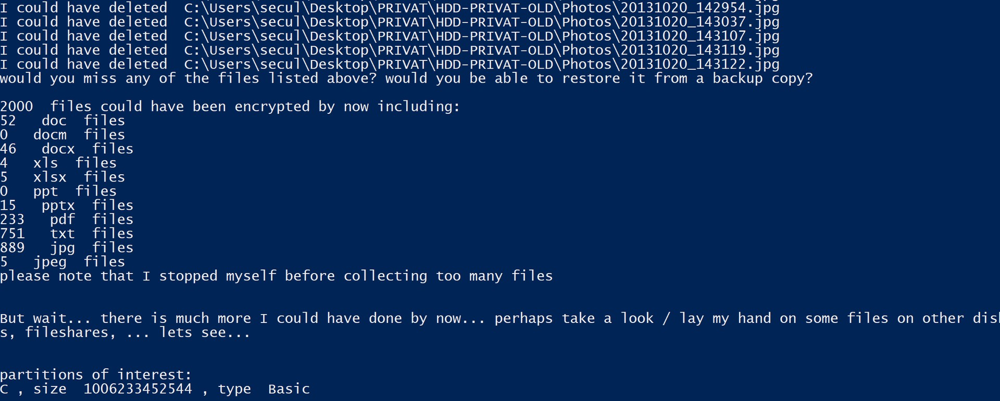

# RansomwareTest
RansomwareTest consists of a word document with a macro and an additional powershell script which acts as a fake ransomware. It is meant to raise awareness for ransomware attacks.

To check whether you are prone to simple ransomware attacks, you just need to open the word document (RansomwareTest.docm). It will trigger a powershell (with the payload contained in dropper.ps1), download the fake ransomware (ifiwasevilyoudbefucked.ps1) from my domain seculancer.de and execute it.

In case you want to skip the step with the word document (e.g. because the AV prevents downloading) you can execute ifiwasevilyoudbefucked.ps1 directly.

You might want to put ifiwasevilyoudbefucked.ps1 on your own server to make sure nothing evil is downloaded from my website. You only need to change the URL in the macro of the word document.

The Word file might get blocked by your AV software (currently virustotal says 20/60 AVs detect this as malicious). I will probably add some more word files with non-trivial dropping functionality - but I am currently not doing this since I do not want to publish good dropper code for the bad guys. Functionality and GUI will also be improved over time.
